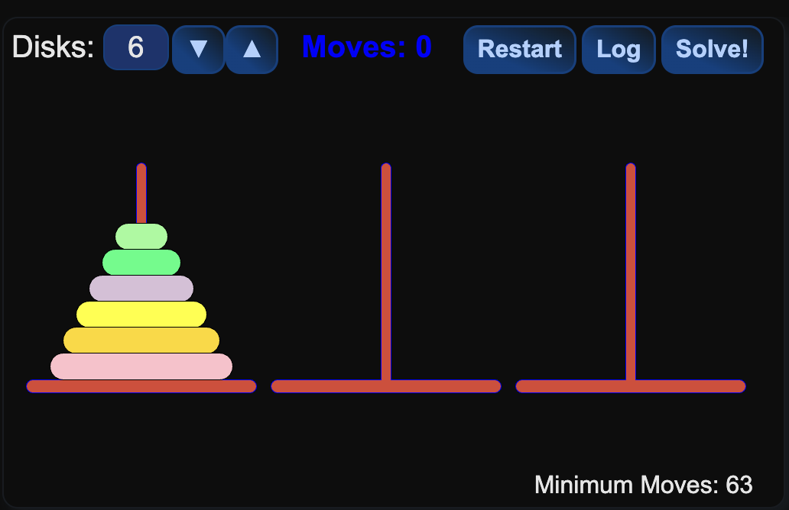

## Description
I want do develop a small tower of hanoi game with Godot.
For that I'll need to finish the tutorial and write a python script that can solfe this with higher order funtions. The Higher order function needs to be done before thursday.
The game should have a simple ui, you can dd more disks and autosolfe it (autosolving meaning that a algorithm calculates what needs to be done and then solves it with a animation)
The piece colour should be a gradiend from bright to dark.

## To Do
- [ ] find out how to solve the hanoi tower problem
- [ ] find out what higher order functions are because our teacher can't teach 
- [ ] Write a algorithm with higher order functions to solve it with python
- [ ] finish the Godot turorial
- [ ] build a tower of hanoi game
- [ ] implement a auto solving function with higher order functions

## Target of the Game
The target of the game is simple, stack the tower the same way as it is at the start but at the third pillar.
## How I think the solution works
You always have a main tower (the tower where the pieces you need to stack on the third pillar are) and two free pillars. 

Here is the main tower with 6 plates.
You want the lowest of those plates to be on the right pillar, meaning that the plate above this plate needs to be in the middle.
Now, in order to get this plate into the middle the plate obove it needs to be on the right. And so on.
I need to find a mathematic formula for this. (fun fact, I don't know how to write a math formula)

## Credits
Tower of Hanoi Website (for the pictures):
https://www.mathsisfun.com/games/towerofhanoi.htmls