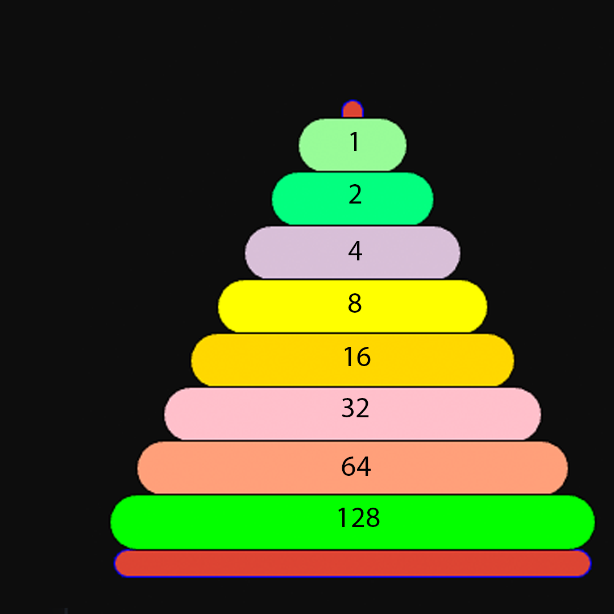

## Descriptions
xl = pillar left
xr = pillar right
xm = pillar middle
px = plate (x = 1-5, five being the biggest)

# Formula

## Stuff I learned

number of plates -2 (top & bottom plate) == numbers of towers that need to be built to move the bottom plate.

On a even number of plates the first pillar needs to be the pillar that the plate does't need to move to
On a UNEVEN (%" != 0") number on the pillar that you want your bottom plate to move to.

HOW TO BUILD TOWERS IN BETWEEN?

move p1, move p2, move p1 onto p2 (repeating untill the end)
move largest exposed plate onto a new field/plate 1 bigger than itself untill tower is moved onto target place.
move plate from new tower onto the plate one smaller than the plate on the ground

I'm stuck, trying now to code this shi... stuff

## Example with 5 plates
1. P1 -> xr
2. P2 -> xm
3. P1 -> xm
4. P3 -> xr
5. P1 -> xl
6. P2 -> xr
7. P1 -> xr
8. P4 -> xm
9. P1 -> xm
10. P2 -> xl
11. P1 -> xl
12. P3 -> xm
13. P1 -> xr
14. P2 -> xm
15. P1 -> xm
16. P5 -> xr

## Calculate how many steps to solve this are needed
As it turns out (after trying stuff and looking at values for a few minutes) all of the plates have a binary value. Yeah, it's that easy.

Meaning, that if you have 1 plate, you need one step, with two you need 3, with 4 you need 15 and so on.
